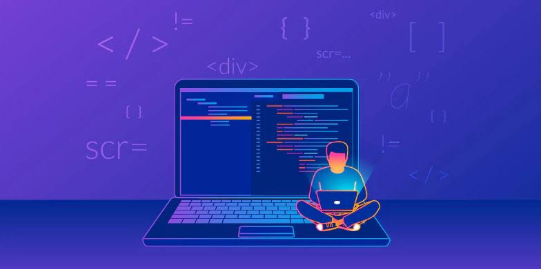

## Welcome

Hi, my name is Emerson Silva and I'm a Web Developer. This repository aims to learn and experiment with new technologies according to market trends, keep in mind that not all codes can work nor are they standardized according to the current patterns of software that exist today. Feel free to review the codes and learn from them.

"Whoever has never made a mistake has never experienced anything new" - Einstein

## Summary

- [HTML](html/) - _Experiments will be focused in new HTML5 APIs._
- [CSS](css/) - _Experiments will be focused in CSS3 Animations._
- [JavaScript](javascript/) - _The experiments will be focused on VanillaJS and the most active frameworks in the market_
- [Ruby](ruby/) - _Focused on learning Ruby on Rails_
- [Pyhton](python/) _Turning applications of machine learning, Watson, Iot and Werables_

## License

[GPL-3.0](emersonjds@fsf.com) © Emerson Silva

